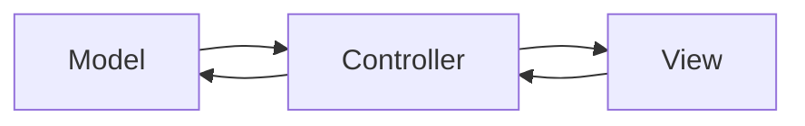
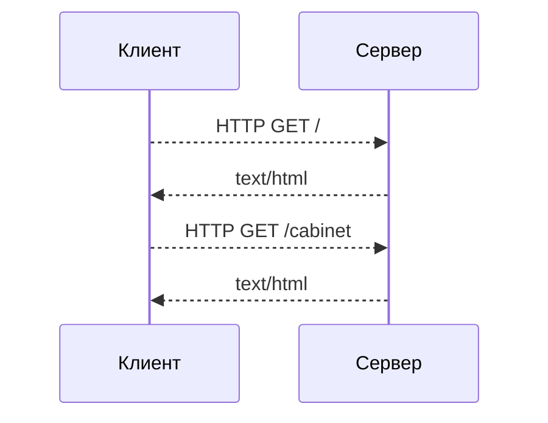
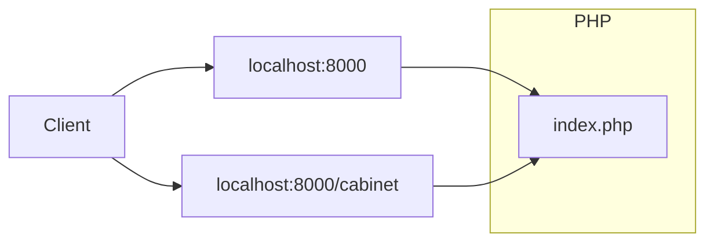
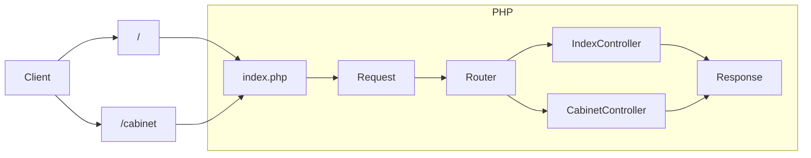
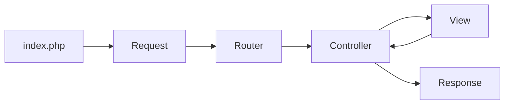
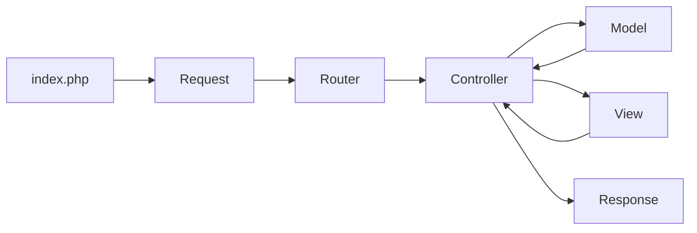

# Веб-сервис на PHP

## Веб в PHP:
В отличие от других языков программирования, PHP содержит множество встроенных особенностей для работы с Веб-страницами.
Эти особенности связаны с его историческим развитием и ролью главного языка для создания веб-сайтов на протяжении многих лет.

Одна из главных фич - PHP является шаблонизатором[^template] и выводит на страницу всё, что не заключено в теги `<?php ?>`. Кроме того, у PHP на борту есть встроенный веб-сервер, который можно использовать для локальной разработки.

Благодаря этому, для создания сайта нам достаточно написать HTML-разметку, поместить код в php-теги и запустить встроенный сервер `php -S localhost:8000`
```php
<!DOCTYPE html>
<html>
    <body>
        <h1><?php echo 'Hello'; ?></h1>
    </body>
</html>
```
>  Вcтроенный сервер предназаначен только для локального запуска и плохо справляется с нагрузкой. В продакшн-среде рекомендуем использовать php-fpm+nginx


На первый взгляд всё хорошо, но при расширении функционала страницы, она очень быстро прирастает кодом, PHP смешивается с HTML и превращается в кашу:
```php
<?php
    include_once 'advert.php';

    $title = htmlentities($_POST['title']);
    $description = htmlentities($_POST['description']);

    if (empty($title)){
        echo "<p class=\"validation-error\">Заголовок не может быть пустым</p>";
    } elseif (empty($description) {
        echo "<p class=\"validation-error\">Описание не может быть пустым</p>";
    } else {
        $data = [
            'title' => $title,
            'description' => $description,
        ];

        $advert = new Advert($data);
        $advert->save();

        echo "<p>Объявление создано: " . $title . "</p>";
    }
?>

<!DOCTYPE html>
<html>
  <head>
    <meta http-equiv="Content-Type" content="text/html; charset=utf-8" />
    <title>Создание объявления</title>
    <style>
      .validation-error{color:red;}
      input{display:block; margin-bottom:10px;}
      h1{font-size:28px;}
      form{padding: 20px 10px;}
    </style>
  </head>

  <body>
    <h1>Новое объявление</h1>

    <form action="submit.php" method="post">
      <label for="">Заголовок:</label>
      <input name="title" id="title" type="text" value="<?php echo($title); ?>" />

      <label for="description">Описание:</label>
      <input name="description" id="description" type="textarea" value="<?php echo($description); ?>" />

      <input type="submit" value="Submit" />
    </form>
  </body>
</html>
```

Разметка, стили и исполняемый код в одном файле! Если представить, что нужно добавить новые поля, их обработку, добавить защиту от XSS-атак, то можно создать огромный файл с очень запутанным кодом, который:
- Сложно понимать, поддерживать и переиспользовать.
- Размывает границу между Back-end и Front-end, затрудняя командную разработку.
- Повышает вероятность допустить уязвимость, особенно если страница взаимодействует с базой данных.

Это всё является следствием нарушения целостности абстракций, как способа борьбы со сложностью систем через скрытие подробностей имплементации.

Любой развивающийся сервис содержит десятки и сотни тысяч строк кода, нуждающихся в поддержке и обновлении. Поэтому код из примера нужен только для того, чтобы знать, как не стоит делать.

## Архитектура Веб-сервиса.

Разработка архитектуры веб-сервиса связана с выстраиванием такого способа взаимодействия между отдельными частями системы, который позволяет упростить её понимание, обслуживание и расширение.

Познакомимся с популярным архитектурным подходом, называемым MVC.   
**MVC** - это архитектурный паттерн, предназначенный для удобной работы c HTTP.


> **Паттерн** - это повторяемая конструкция, которая решает часто возникающие проблемы или задачи.
> В любом случае это не догма и не спецификация и всегда оставляет вам место для самостоятельного выбора.

Расшифровка аббревиатуры **MVC:**
- **M - Model** - Слой логического ядра приложения. Изолирует в себе всю работу с предметной областью сервиса. Взаимодействует с хранилищем данных.
- **С - Controller**  - обработчик и входная точка. Валидирует входищие данные и передаёт управление в Model. Получив ответ от слоя Model, отдаёт данные в View.
- **V - View** - Слой, отвечающий за отображение данных. Он получает данные от Controller. Наиболее часто используется для отрисовки веб-страниц.



Какая бы ни была архитектура вашего приложения - основная идея в том, чтобы разделить его на слои абстракции, каждый из которых будет изолированно выполнять свою роль. Хорошее разделение позволяет программисту целиком воспринимать слой программы, над которым он сейчас работает и не отвлекаться на другие.

Например, при написании логики расчёта общего веса товаров в корзине, сложно одновременно держать в голове какими именно SQL-запросами были получены товары из базы данных. Мы можем решить эту проблему, выделив логику в отдельный слой. Выделение отдельной абстракции так-же позволит нам подменять реализацию получения данных без изменения бизнес-логики, но об этом позже.

### Жизненный цикл
Перед тем, как приступить к практической разработке сервиса, вспомним как программы обмениваются данными по сети и выделим общие признаки для всех веб-сервисов.

HTTP - основной протокол, используемый в веб для передачи и получения данных. Данными в этом случае обмениваются два участника - Клиент и Сервер.



1. Клиент (браузер, постман, curl и т.д.) делает HTTP-запрос на адрес нашего сервиса.  
   Запрос может быть в корень сайта localhost:8000 или запрос localhost:8000/health или localhost:8000/cabinet.   
   То, что расположено после хоста и порта (**/cabinet**), обычно называют путём или path. Cинонимы: относительный uri, эндпоинт, роут.
2. Сервер возвращает ответ в виде строки (json, html, простой текст) с успешным статусом или ошибкой.
   Формат не зависит от кода, и клиент не знает на каком языке написана логика, вернувшая ответ.

Что происходит внутри сервера:

Внутри сервера работает программа, которая:
1. Принимает запрос.
2. Определяет какое действие нужно выполнить (Маршрутизация).
3. Выполняет обработку.
4. Возвращает ответ в формате, в котором клиент готов его воспринять.

Эти 4 шага можно взять за основу нашей архитектуры, так как они будут выполняться в любом случае, независимо от логики приложения.
Cхема будет расширяться по мере раширения архитектуры сервиса и внедрения новых слоёв.

## Создание сервиса на PHP - Админка для объявлений
Для начала определимся с базовым функционалом сервиса:

- Из браузера должно быть доступно:
    - Создание объявлений
    - Валидация объявлений
    - Просмотр списка объявлений
- У объявления должен быть заголовок, описание и цена.

Начнём создание нового проекта с чистого листа, и для начала необходимо создать директорию и инициализировать новый пакет через composer:

```bash
mkdir my-php-project
cd my-php-project
composer init
```

Создадим файл index.php в директории public
```bash
mkdir public
touch public/index.php
```

Открываем любимый редактор и пишем зачаток нашего сервиса, выведем на экран содержимое глобальной переменной `$_SERVER`:
```php
<?php

echo '<pre>';
print_r($_SERVER);
```

Убедимся в том, что наш скрипт работает и запустим встроенный PHP-сервер в директории `public`.
```bash
php -S localhost:8000
```
Если перейти по адресу http://localhost:8000/, то можно увидеть вывод ассоциативного массива с данными сервера.
Сейчас нас интересует значение REQUEST_URI, и REQUEST_METHOD, показывающие, по какому пути и методу HTTP хочет обратиться клиент.

К примеру, если сделать запрос http://localhost:8000/hello, то REQUEST_URI будет содержать строку `/hello`
На основе этих значений и можно выбирать логику обработки запроса (Выполнить маршрутизацию)

Давайте попробуем сделать это и напишем простую реализацию роутера.

```php
<?php

$uri = $_SERVER['REQUEST_URI'];

if ($uri === '/hello') {
    $name = $_GET['name'] ?? 'guest';

    echo 'Hello ' . $name;
} elseif ($uri === '/server') {
    header('Content-Type: application/json; charset=utf-8');
    json_encode($_SERVER, JSON_PRETTY_PRINT|JSON_UNESCAPED_UNICODE);
} else {
    header("HTTP/1.1 404 Not Found");

    echo '404 Not Found';
}
```
Попробуем перейти по адресам и проверить вывод:
http://localhost:8000/hello
http://localhost:8000/server
http://localhost:8000/blabla

Теперь воспользуемся написанным нами функционалом по выводу имени и перейдём в http://localhost:8000/hello?name=Stark

Вместо приветствия выводится 404.

REQUEST_URI - содержит query-параметры, `/hello?name=Stark` и уже не подходят ни по одному условию.
Решить проблему можно с помощью функции `parse_url()`, которая разобъёт нашу строку на 2 части - `path` и `query`.

И это только одна из проблем, с которыми мы столкнёмся при разработке роутера. Например:
- Что если мы забудем прописать нужный заголовок, или допустим в нём ошибку?
- Что делать, если пользователь введёт адрес с закрывающим слешем?: http://localhost:8000/hello/
- Как декодировать и кодировать html-символы
- Как защищаться от XSS-атак.

### Разбиение на слои абстракции
Наденем мантию архитектора и подумаем, что из кода выше можно выделить и абстрагировать, чтобы можно было писать бизнес-логику и не отвлекаться на проблемы с запросами, ответами, заголовками и прочим, связанным с HTTP.

- **Запрос (Request)** - Содержит в себе заголовки, тело и предоставляет методы для работы с ними.
- **Ответ (Response)** - Содержит заголовки, тело ответа и предоставляет методы для работы с ними.
- **Router** - Позволяет определить какой код нужно выполнить на основании Запроса.
- **Controller** - Класс, методы которого будут запущены роутером. Получает Запрос, формирует и возвращает Ответ.

Обновим нашу схему:



Можно реализовать эти абстракции самостоятельно, написав на каждый из них свой класс. И это будет очень хорошим решением, если вы хотите попрактиковаться в проектировании HTTP-фреймворка.

> **Фреймворки** - предоставляют готовую базовую архитектуру и множество встроенных возможностей, в мире PHP ориентированы на создание сайтов.
>
> **Микрофреймворки** - предоставляют набор базовых инструментов для создания веб-приложений, маршрутизация - один из них. Но не обязывает следовать определенной архитектуре.
>
> По-сути, фреймворк - готовый набор инструментов для решения задач, которые часто встречаются в веб-разработке.

Все фреймворки решают примерно одинаковый круг задач. Что именно выбрать и использвать ли их вообще - зависит от ситуации и опыта программиста.

Созданием своего фреймворка - это круто и очень сильно расширяет кругозор. Но, к сожалению, не приблизит нас к решению задачи, которую мы поставили перед собой - написание админки для объявлений. Поэтому подключим один из популярных микрофреймворков и воспользуемся им для работы с HTTP.

### Подключаем микрофреймворк Slim.
Slim - лёгкий микрофреймворк, содержащий только самые базовые инструменты, хорошо подходящий для обучения и маленьких проектов.

Воспользуемся инструкцией из [документации](https://www.slimframework.com/docs/v4/) и установим микрофреймворк в зависимости нашего проекта:
```bash
composer require slim/slim slim/psr7 slim/http slim/twig-view
```

Скопируем пример из документации в файл `public/index.php`:
```php
// public/index.php
<?php

require __DIR__ . '/../vendor/autoload.php';

use Psr\Http\Message\ResponseInterface as Response;
use Psr\Http\Message\ServerRequestInterface as Request;
use Slim\Factory\AppFactory;

$app = AppFactory::create();
$app->addErrorMiddleware(true, true, true);

$app->get('/', function (Request $request, Response $response, $args) {
    $response->getBody()->write("Hello world!");
    return $response;
});

$app->run();
```

Код в примере:
- Создаёт объект приложения App
- Добавляет Middleware[^middleware] (промежуточный обработчик) для отлова ошибок
- Добавляет роут `/` для обработки домашней страницы и его обработчик в виде анонимной функции, принимающей запрос и возвращающей ответ.

Теперь можно снова открыть в браузере http://localhost:8000 и убедиться, что приложение запущено.

## Слой Controller - обрабатываем вызовы
Воспользуемся роутером микрофреймворка и сделаем функции-обработчики для тех страниц, что мы сделали ранее. Обратите внимание на синтаксис передачи анонимной функции как параметра другой функции.
```php
<?php

require __DIR__ . '/../vendor/autoload.php';

use Slim\Factory\AppFactory;
use Slim\Http\Response;
use Slim\Http\ServerRequest;

$app = AppFactory::create();
$app->addErrorMiddleware(true, true, true);

$app->get('/', function (ServerRequest $request, Response $response) {
    $response->getBody()->write('Hello Kolesa Backend Upgrade!');

    return $response;
});

$app->get('/hello', function (ServerRequest $request, Response $response) {
    $name = $request->getQueryParam('name', 'guest');
    $response->getBody()->write('Hello ' . $name);

    return $response;
});

$app->get('/server', function (ServerRequest $request, Response $response) {
    return $response->withJson($_SERVER);
});

$app->run();
```
Появилось взаимодействие с новыми объектами `$request` и `$response`, которые абстрагируют в себе корректную обработку HTTP-запроса и генерацию HTTP-ответа.
Теперь не нужно заботиться о том, как получать данные из QueryString или создавать заголовок, сообщающий о типе возвращаемого контента.

Далее необходимо вынести обработку запросов в отдельные классы и методы. Это упростит поддержку и создание новых контроллеров.

### Создание структуры проекта и подключение неймспейса
Создадим директорию ```src``` для кода сервиса, и создадим там поддиректории ```src/Http/Controllers```:
```bash
mkdir src
mkdir src/Http
mkdir src/Http/Controllers
```

Обновим наш comsposer.json секцией `autoload` для того, чтобы работала автозагрузка классов по стандарту PSR-4
```json
{
    "name": "example/moder",
    "type": "project",
    "autoload": {
        "psr-4": {
             "App\\": "src/"
       }
    },
    "require": {
        "slim/slim": "^4.10",
        "slim/psr7": "^1.5",
        "slim/http": "^1.2",
        "slim/twig-view": "^3.3"
    }
}
```

Выполним перегенерацию файла автозагрузки (Это нужно сделать один раз после изменения `composer.json`):
```
composer dump-autoload
```

### Объявление классов контроллеров и их использование.
В свежесозданную директорию добавим файл `IndexController.php` с классом `IndexController`
```php
<?php
namespace App\Http\Controllers;

use Slim\Http\ServerRequest;
use Slim\Http\Response;

class IndexController
{
    public function home(ServerRequest $request, Response $response)
    {
        $response->getBody()->write('Добро пожаловать в панель управления');

        return $response;
    }
}
```

Далее, необходимо привязать контроллер к роуту, согласно [документации](https://www.slimframework.com/docs/v4/objects/routing.html#container-resolution):
```php
// public/index.php
<?php

require __DIR__ . '/../vendor/autoload.php';

// Подключенный неймспейс контроллеров
use App\Http\Controllers;
use Slim\Factory\AppFactory;

$app = AppFactory::create();
$app->addErrorMiddleware(true, true, true);

// Первый аргумент - путь, второй - полное имя класса(FQDN) и название метода, который необходимо вызвать.
$app->get('/', Controllers\IndexController::class . ':home');

$app->run();

```

`::class` - выводит [полное имя класса](https://www.php.net/manual/ru/language.oop5.basic.php#language.oop5.basic.class.class), включая неймспейс.

Снова открываем http://localhost:8000/ и убеждаемся, что наш контроллер подключен.

## Слой View - рисуем web-страницы
Для отображения HTML-страниц воспользуемся шаблонизатором [Twig](https://www.slimframework.com/docs/v4/features/templates.html#the-slimtwig-view-component), который мы уже установили.

Первым делом регистрируем его в index.php:
```php
<?php

require __DIR__ . '/../vendor/autoload.php';

use App\Http\Controllers;
use Slim\Factory\AppFactory;
use Slim\Views\Twig;
use Slim\Views\TwigMiddleware;

// Созадние объекта шаблонизатора Twig
$twig = Twig::create(__DIR__ . '/../templates', ['cache' => false]);
$app  = AppFactory::create();
$app->addErrorMiddleware(true, true, true);
// Регистрируем шаблонизатор в приложении
$app->add(TwigMiddleware::create($app, $twig));

$app->get('/', Controllers\IndexController::class . ':home');

$app->run();
```
Теперь напишем HTML-шаблоны `base.twig` и `home.twig` в директории `templates`.
Шаблоны можно расширять, для того, чтобы не писать каждый раз всю обёртку.

templates/base.twig:
```html
<!DOCTYPE html>
<html lang="ru">
<head>
    <meta charset="UTF-8">
    <meta name="viewport"
          content="width=device-width, user-scalable=no, initial-scale=1.0, maximum-scale=1.0, minimum-scale=1.0">
    <meta http-equiv="X-UA-Compatible" content="ie=edge">
    <title>Панель управления</title>
</head>
<body>

</body>
</html>
```

templates/home.twig:
```html



    <h1>Добро пожаловать в панель управления, {{ name }}</h1>

```
`{{ name }}` - Синтаксис для вывода переменных в Twig. Подробнее в [официальной документации](https://twig.symfony.com/doc/3.x/)

Вызовем метод отрисовки шаблона в контроллере `IndexController`:
```php
<?php
namespace App\Http\Controllers;

use Slim\Http\ServerRequest;
use Slim\Http\Response;
use Slim\Views\Twig;

class IndexController
{
    public function home(ServerRequest $request, Response $response)
    {
        $view = Twig::fromRequest($request);

        return $view->render($response, 'home.twig', ['name' => 'guest']);
    }
}
```


Теперь можно открыть главную страницу сайта http://localhost:8000 и убедиться, что шаблон был обработан.
Теперь в нашем приложении уже есть 2 слоя из паттерна MVC - View и Controller.

Добавим  View-компонент нашей архитектуры в схему сервиса:



## Слой Model - пишем бизнес-логику
В Model изолируется всё, что касается логики сервиса, который мы пишем.
Чем меньше он будет зависеть от слоя представления (View) и контроллера (Controller), тем проще нам будет расширять функционал сервиса.
> Часто понятие модели из паттерна MVC путают с сущностями предметной области. В рамках практики такие сущности будем называть Entity.

Создадим отдельную директорию для слоя логики: `src/Model` и в ней поддиректорию `Entity`

Далее объявим класс объявления - `Advert` и создадим в нём свойства и методы для представления:
- Заголовока
- Описания
- Цены

```php
<?php
// src/Model/Entity/Advert.php

namespace App\Model\Entity;

class Advert
{
    private ?int    $id;
    private ?string $title;
    private ?string $description;
    private ?int    $price;

    public function __construct($data = [])
    {
        $this->id = $data['id'] ?? null;
        $this->title = $data['title'] ?? null;
        $this->description = $data['description'] ?? null;
        $this->price = $data['price'] ?? null;
    }

    public function getId(): ?int
    {
        return $this->id;
    }

    public function getTitle(): string
    {
        return $this->title ?? '';
    }

    public function getDescription(): string
    {
        return $this->description ?? '';
    }

    public function getPrice(): ?int
    {
        return $this->price;
    }
}
```

## Хранение данных
Теперь нужно подумать о том, где и как хранить наши объявления.
PHP запускается на один запрос и все программы на нём по-умолчанию не имеют состояния (stateless).
Поэтому мы не можем проигнорировать необходимость хранения данных, даже при большом желании.

### Паттерн Repository.
Хорошей практикой является абстрагирование получения данных от их использования.
Внедрим для этого ещё один очень популярный паттерн проектирования **Repository**, который представляет собой класс, скрывающий в себе подробности реализации получения и сохранения данных.
Код, который использует Репозиторий для получения данных, не знает и не должен ничего знать о том как хранятся данные. Под капотом это может быть любая БД, ORM, файл, сторонний сервис, кэш. Всё что угодно.

Примеры использования репозитория:
```php
// Получить объект, представляющий кота
$cat = $catRepository->getOne($catId);

// Создать новый объект кота
$ourCat = new Cat('Tom');

// Сохранить новый объект кота
$catRepository->save($ourCat);
```

### Реализация Repository
Репозиторий объявлений будет представлять отдельный класс `AdvertRepository`
Реализуем получение всех объявлений. Получать объявления мы будем из файла `storage/adverts.json`.
использование json-файла как базы данных - очень простой, но не рабочий в рамках продакшна способ из-за отсутствия механизма конкурентного сохранения данных в файл.

**src/Model/Repository/AdvertRepository.php:**
```php
<?php

namespace App\Model\Repository;

use App\Model\Entity\Advert;

class AdvertRepository
{
    private const DB_PATH = '../storage/adverts.json';

    public function getAll()
    {
        $result = [];

        foreach ($this->getDB() as $advertData) {
            $result[] = new Advert($advertData);
        }

        return $result;
    }

    private function getDB(): array
    {
        return json_decode(file_get_contents(self::DB_PATH), true) ?? [];
    }
}
```

- **file_get_contents()** - функция для получения содержимого файла.
- **json_decode()** - функция, превращающая json в PHP-массив.

**Обновляем схему, теперь в ней есть слой Model:**


Теперь создадим контроллер и HTML для вывода списка объявлений:

**templates/adverts/index.twig:**
```html



    <h1>Список объявлений</h1>

    <ul>
        
            <li>{{ advert.getTitle() }}</li>
        
    </ul>

```

**src/Http/Controllers/AdvertController.php:**
```php
<?php

namespace App\Http\Controllers;

use App\Model\Repository\AdvertRepository;
use Slim\Http\ServerRequest;
use Slim\Http\Response;
use Slim\Views\Twig;

class AdvertController
{
    public function index(ServerRequest $request, Response $response)
    {
        $advertsRepo = new AdvertRepository();
        $adverts     = $advertsRepo->getAll();

        $view = Twig::fromRequest($request);

        return $view->render($response, 'adverts/index.twig', ['adverts' => $adverts]);
    }
}
```

**storage/adverts.json**

### Создание и сохранение нового объявления
Добавим в наш репозиторий новые методы, позволяющие создавать и сохранять объявления.

```php
<?php

namespace App\Model\Repository;

use App\Model\Entity\Advert;

class AdvertRepository
{
   // Другой код

    public function create(array $advertData): Advert {
        $db               = $this->getDB();
        $increment        = array_key_last($db) + 1;
        $advertData['id'] = $increment;
        $db[$increment]   = $advertData;

        $this->saveDB($db);

        return new Advert($advertData);
    }

    private function getDB(): array
    {
        return json_decode(file_get_contents(self::DB_PATH), true) ?? [];
    }

    private function saveDB(array $data):void
    {
        file_put_contents(self::DB_PATH, json_encode($data));
    }
}
```

Добавим в контроллер 2 новых метода.
- **newAdvert** отвечает за отображение формы сохранения.
- **create** за обработку данных формы

Инициализируем репозиторий в контроллере и вызовем метод `$repository->create()`
После успешного сохранения объявления, происходит редирект на общий список объявлений.   
**src/Http/Controllers/AdvertController.php:**
```php
<?php

namespace App\Http\Controllers;

use App\Model\Repository\AdvertRepository;
use Slim\Http\ServerRequest;
use Slim\Http\Response;
use Slim\Views\Twig;

class AdvertController
{
    // Другой код

    public function newAdvert(ServerRequest $request, Response $response) {
        $view = Twig::fromRequest($request);

        return $view->render($response, 'adverts/new.twig');
    }

    public function create(ServerRequest $request, Response $response)
    {
        $repo        = new AdvertRepository();
        $advertData  = $request->getParsedBodyParam('advert', []);
        $repo->create($advertData);

        return $response->withRedirect('/adverts');
    }
}
```

Инициализируем новые обработчики в `index.php`.
Обратите внимание на то, что адрес `adverts` указан здесь дважды, но с разными HTTP-методами. Маршрутизация может осуществляться не только по адресу, но и по методу.   
**public/index.php:**
```php
<?php

require __DIR__ . '/../vendor/autoload.php';

use App\Http\Controllers;
use Slim\Factory\AppFactory;
use Slim\Views\Twig;
use Slim\Views\TwigMiddleware;

$twig = Twig::create(__DIR__ . '/../templates', ['cache' => false]);
$app  = AppFactory::create();
$app->addErrorMiddleware(true, true, true);
$app->add(TwigMiddleware::create($app, $twig));

$app->get('/', Controllers\IndexController::class . ':home');
$app->get('/adverts', Controllers\AdvertController::class . ':index');
$app->get('/adverts/new', Controllers\AdvertController::class . ':newAdvert');
$app->post('/adverts', Controllers\AdvertController::class . ':create');

$app->run();
```

Пишем HTML-форму для создания объявлений.   
**templates/adverts/new.twig**
```html



    <h1>Подать новое объявление</h1>

    <form action="/adverts" method="post">
        <div>
            <label>
                Заголовок *
                <input type="text" name="advert[title]" value="">
            </label>
        </div>
        <div>
            <label>
                Описание *
                <input type="text" name="advert[description]" value="">
            </label>
        </div>
        <div>
            <label>
                Цена *
                <input type="number" name="advert[price]" value="">
            </label>
        </div>
        <input type="submit" value="Create">
    </form>

```
При реализации форм, часто приходится писать один и тот-же код. Для упрощения работы с ними существуют специальные конструкторы форм.
Один из таких - [Symfony Forms](https://symfony.com/doc/current/forms.html#building-forms).

## Валидация данных
Формы обычно сообщают о том, что данные некорректно заполнены. Давайте создадим отдельный класс валидаторов.

**src/Model/Validators/AdvertValidator.php**
```php
<?php

namespace App\Model\Validators;

class AdvertValidator
{
    private const NOT_EMPTY_FIELDS = ['title', 'description'];
    private const MIN_TITLE_LENGTH = 10;
    private const MAX_TITLE_LENGTH = 80;
    private const MIN_PRICE = 0;
    private const MAX_PRICE = 100000;

    public function validate(array $data): array
    {
        $errors = $this->validateNotEmpty($data);

        if (!empty($errors)) {
            return $errors;
        }

        return array_merge(
            $this->validateLength($data),
            $this->validatePrice($data)
        );
    }

    private function validateNotEmpty(array $data): array
    {
        $errors = [];

        foreach (self::NOT_EMPTY_FIELDS as $fieldName) {
            $value = $data[$fieldName] ?? null;

            if (empty($value)) {
                $errors[$fieldName] = 'Поле "' . $fieldName . '" не должно быть пустым';
            }
        }

        return $errors;
    }

    private function validateLength(array $data): array
    {
        $titleLength = mb_strlen($data['title']);

        if ($titleLength < self::MIN_TITLE_LENGTH) {
            return [
                'title' => 'Заголовок не может быть меньше ' . self::MIN_TITLE_LENGTH . ' символов'
            ];
        }

        if ($titleLength > self::MAX_TITLE_LENGTH) {
            return [
                'title' => 'Заголовок не может быть больше ' . self::MAX_TITLE_LENGTH . ' символов'
            ];
        }

        return [];
    }

    private function validatePrice(array $data): array
    {
        $price = $data['price'] ?? 0;

        if ($price < self::MIN_PRICE) {
            return [
                'price' => 'Цена не может быть меньше ' . self::MIN_PRICE,
            ];
        }

        if ($price > self::MAX_PRICE) {
            return [
                'price' => 'Цена не может быть больше ' . self::MAX_PRICE,
            ];
        }

        return [];
    }
}
```

**src/Http/Controllers/AdvertController.php**
```php
<?php

namespace App\Http\Controllers;

use App\Model\Repository\AdvertRepository;
use App\Model\Validators\AdvertValidator;
use Slim\Http\ServerRequest;
use Slim\Http\Response;
use Slim\Views\Twig;

class AdvertController
{
    public function index(ServerRequest $request, Response $response)
    {
        $advertsRepo = new AdvertRepository();
        $adverts     = $advertsRepo->getAll();

        $view = Twig::fromRequest($request);

        return $view->render($response, 'adverts/index.twig', ['adverts' => $adverts]);
    }

    public function newAdvert(ServerRequest $request, Response $response) {
        $view = Twig::fromRequest($request);

        return $view->render($response, 'adverts/new.twig');
    }

    public function create(ServerRequest $request, Response $response)
    {
        $repo        = new AdvertRepository();
        $advertData  = $request->getParsedBodyParam('advert', []);

        $validator = new AdvertValidator();
        $errors    = $validator->validate($advertData);

        if (!empty($errors)) {
            $view = Twig::fromRequest($request);

            return $view->render($response, 'adverts/new.twig', [
                'data'   => $advertData,
                'errors' => $errors,
            ]);
        }

        $repo->create($advertData);

        return $response->withRedirect('/adverts');
    }
}
```
Теперь у нас есть расширяемая структура проекта, функционал сохранения объявлений, их валидация и отображение списка.

Проект обрёл следующую структуру, и готов к дальнейшему расширению и улучшению:
```
├───README.md
├───composer.json
├───composer.lock
├───public
│       └───index.php
├───src
│       ├───Http
│       │       └───Controllers
│       │               ├───AdvertController.php
│       │               └───IndexController.php
│       └───Model
│               ├───Entity
│               │       └───Advert.php
│               ├───Repository
│               │       └───AdvertRepository.php
│               └───Validators
│                       ├───AdvertValidator.php
│                       └───ValidatorInterface.php
├───storage
│       └───adverts.json
├───templates
│       ├───adverts
│       │       ├───index.twig
│       │       └───new.twig
│       ├───base.twig
│       └───home.twig
└───vendor

```

## Самостоятельная работа
Для самостоятельной работы можно расширить функционал:
- Реализовать просмотр страницы объявления
- Реализовать редактирование объявления
- Отрефакторить репозиторий на хранение объявлений в mySQL вместо json-файла.
- Добавить в объявление статус "На сайте", "В Архиве", "Удалено"
- Добавить поиск по базе данных

## Полезные ссылки
- [Уровни (слои) абстракции](https://ru.wikipedia.org/wiki/%D0%A3%D1%80%D0%BE%D0%B2%D0%B5%D0%BD%D1%8C_%D0%B0%D0%B1%D1%81%D1%82%D1%80%D0%B0%D0%BA%D1%86%D0%B8%D0%B8_(%D0%BF%D1%80%D0%BE%D0%B3%D1%80%D0%B0%D0%BC%D0%BC%D0%B8%D1%80%D0%BE%D0%B2%D0%B0%D0%BD%D0%B8%D0%B5))
- [MVC простыми словами](https://ru.hexlet.io/blog/posts/chto-takoe-mvc-rasskazyvaem-prostymi-slovami)
- [Микрофреймворк Slim](https://www.slimframework.com/docs/v4/)
- [Front Controller](https://en.wikipedia.org/wiki/Front_controller)
- [PSR-7](https://www.php-fig.org/psr/psr-7/)
- [RESTful Routing](https://www.learnhowtoprogram.com/c-and-net/basic-web-applications/introduction-to-restful-routing)
- [Symfony Form Builder](https://symfony.com/doc/current/forms.html#building-forms)

****
[^template]: **Шаблонизатор** - инструмент, позволяющий управлять HTML-разметкой с помощью кода. Используется для динамической подстановки данных в **шаблон**, который представляет собой HTML с дополнительным синтаксисом вставки данных.

[^middleware]: **Midlleware** - промежуточный обработчик кода, выполняющися до передачи управления в контроллер или до возврата ответа. Как и контроллер, принимает запрос и ответ, и может модифицировать их. Часто используется для авторизации пользователя и обработки ошибок.
